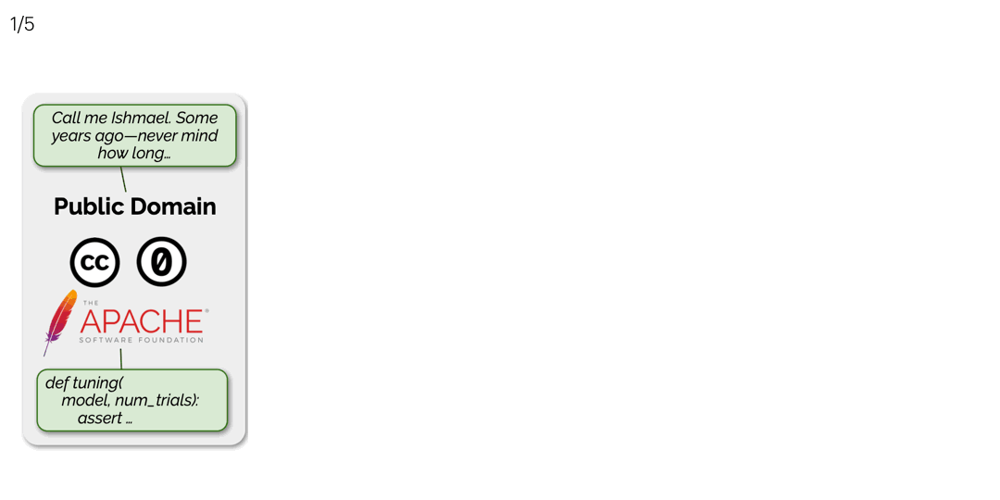

# SILO Language Models

This includes an original implementation of **[SILO Language Models: Isolating Legal Risk In a Nonparametric Datastore](https://arxiv.org/abs/2308.04430)** by [Sewon Min](https://shmsw25.github.io/):star2:, [Suchin Gururangan](https://suchin.io/):star2:, [Eric Wallace](https://www.ericswallace.com/), [Hannaneh Hajishirzi](https://homes.cs.washington.edu/~hannaneh/), [Noah
  A. Smith](https://nasmith.github.io/), and [Luke Zettlemoyer](https://www.cs.washington.edu/people/faculty/lsz) (:star2:: Equal contribution).

<p align="center">
  
</p>

If you find our code, data, models, or the paper useful, please cite the paper:
```
@article{ silo,
    title={ {SILO} Language Models: Isolating Legal Risk in a Nonparametric Datastore },
    author={ Min, Sewon and Gururangan, Suchin and Wallace, Eric and Hajishirzi, Hannaneh and Smith, Noah and Zettlemoyer, Luke },
    year={ 2023 },
    journal={ arXiv preprint arXiv:2308.04430 },
    url={ https://arxiv.org/abs/2308.04430 }
}
```

For any questions related to the code, data, models or the paper, please leave [issues](https://github.com/kernelmachine/silo-lm/issues) or contact [first authors](mailto:sewon@cs.washington.edu,sg01@cs.washington.edu).

## Content

1. [Quick links](#quick-links)
2. [Training](#training)
3. [Inference](#inference)
    1. [Preparation](#preparation)
        * [Installation](#installation)
        * [Download data](#download-data)
        * [Tokenization](#tokenization)
    2. [Parametric-only language model](#parametric-only-language-model)
    3. [kNN-LM](#knn-lm)
    4. [Retrieve-in-context LM](#retrieve-in-context-lm)

## Quick links

You can access the Open License Corpus and pretrained SILO Models on Hugging Face :hugs:

* Link to the [Open License Corpus](https://huggingface.co/datasets/kernelmachine/open-license-corpus)
* Link to [SILO-PD-1.3B](https://huggingface.co/kernelmachine/silo-pd-1.3b)
* Link to [SILO-PDSW-1.3B](https://huggingface.co/kernelmachine/silo-pdsw-1.3b)
* Link to [SILO-PDSWBY-1.3B](https://huggingface.co/kernelmachine/silo-pdswby-1.3b)

## Training

We use OpenLM, a new model training library, to train SILO LMs. Stay tuned for a link to that repo!

## Inference

We host a script to run the parametric LM, kNN-LM, and RIC-LM using the HF model.
By default, all outputs are being saved under `out`. 

### Preparation

#### Installation

The code was tested with python 3.9.

```bash
conda create -n silo python=3.9
conda activate silo
pip install -r requirements.txt
```

To run kNN-LM, run the following as well.
```bash
conda install -c pytorch -c nvidia faiss-gpu=1.7.4 mkl=2021
```

To run RIC-LM, run the following as well.
```bash
pip install pyserini
conda install -c conda-forge openjdk=11
```

#### Download Data

*Notes*: In order to process `MIMIC_III`, you first need to go through the official approval process from [the website](https://physionet.org/content/mimiciii/1.4/).
Then, you will be able to get access to `NOTEEVENTS.csv`, which you can place under `data/`.

```bash
python scripts/download_data.py --subset the-pile
python scripts/download_data.py --subset cc-news
python scripts/download_data.py --subset MIMIC_III
python scripts/download_data.py --subset amazon
```

You can optionally specify `--split` to indicate whether you want to download `train`, `val` or `test`, separately by comma. Default value is `train,val,test`.

The training data is only required for building a datastore. Therefore, if you are mainly interested in parametric LMs, you won't need to download the training data. In this case, simply specify `--split val,test`.

For the Pile, in order to release the minimal data to reproduce the experiments in the paper, we release the training data on five domains that we include in the paper, i.e., `Wikipedia_(en)`, `NIH_ExPorter`, `Books3`, `Github`, and `Enron_Emails`. The script to reproduce experiments in any domain requires running a deduplication script, because we performed an additional filtering of the training data against the val/test data of the Pile. We will release it in the future.

#### Tokenization

You should first tokenize the PILE by run the following.
```bash
PYTHONPATH=. python scripts/main.py \
    --task tokenize \
    --split {val|test|train} \
    --subset "FreeLaw,Gutenberg_(PG_19),HackerNews,Github,NIH_ExPorter,PhilPapers,Wikipedia_(en),cc-news,BookCorpus2,Books3,OpenWebText2,Enron_Emails,amazon,MIMIC_III" \
    --lm pythia-1.4B
```

Specify `--subset` separated by a comma to specify multiple subsets (domains).
You don't need to tokenize the training data if you are mainly interested in evaluating the parametric LM.

### Parametric-only language model

**Note**: Please specify `--lm pythia-1.4B` for the Pythia baseline, and `--lm silo-pd-1.3b`, `--lm silo-pdsw-1.3b`, or `--lm silo-pdswby-1.3b` for SILO, trained on either the PD subset, the PDSW subset and all data (PDSWBY). From here, we will use `--lm silo-pdsw-1.3b` in the example commands but the same commands will work for all models. All four models share the tokenizer, and it is not necessary to run tokenization for each model separately.


To encode & get LM perplexity, run the following:
```bash
PYTHONPATH=. python scripts/main.py \
    --task encode \
    --split {val|test} \
    --max_seq_length 1024 \
    --stride 512 \
    --subset "FreeLaw,Gutenberg_(PG_19),HackerNews,Github,NIH_ExPorter,PhilPapers,Wikipedia_(en),cc-news,BookCorpus2,Books3,OpenWebText2,Enron_Emails,amazon,MIMIC_III" \
    --lm silo-pdsw-1.3b
```

Once it's done with getting perplexity, it will save the values in a file. When you run the same command again, it will simply read the file instead of re-running the model.

* Please specify `--batch_size` in order to adjust the batch size. Note that the maximum batch size that fits into the GPU may vary between Pythia and SILO (SILO can usually take 2-3x larger batch size).
* You can also evaluate your own hf model. Place your hf model under `ckpt/{your_hf_model_name}`, and specify `--lm {your_hf_model_name}`.
* By default, it will save both LM perplexity and embeddings from the model, which is needed for nonparametric LMs. If you do not plan to use nonparametric LM, you can skip saving embeddings by specifying `--skip_embed`.

### kNN-LM

#### A quick tutorial on `Enron_Emails`.

First, this is the command line for `Enron_Emails`.

```bash
# First, get embeddings from the training data.
PYTHONPATH=. python scripts/main.py \
    --task encode \
    --split train \
    --max_seq_length 1024 \
    --stride 512 \
    --subset Enron_Emails \
    --lm silo-pdsw-1.3b
# Then, build the FAISS index and run evaluation.
PYTHONPATH=. python scripts/main.py \
    --task inference \
    --split train \
    --val_split {val|test} \
    --max_seq_length 1024 \
    --stride 512 \
    --subset Enron_Emails \
    --lm silo-pdsw-1.3b
```

* You can specify `--approximate` for approximate nearest neighbor search, which significantly speed-ups the inference with little drop in performance. In the paper, we did not use `--approximate` for `Enron_Emails`, but used it for the rest of the domains whose datastores are much larger.
* You can specify `--probe` (default: `8`). A smaller value will linearly speed-up the inference with little drop in performance. In the paper, we use `8`.
* You can specify `--do_subset` in order to evaluate on a subset of 1.024M tokens, which is often enough to give stable PPL values.
* If you run the same command, it will load the saved result file and display the results without re-running kNN-LM.

#### For other datasets

For datasets other than `Enron_Emails`, the training data is large, so we shard them and process them one by one.
Each iteration contains two command lines. The first one can be done in parallel, but the second one has to be done sequentially.

```bash
# See the table below to find out how many indices you need for each domain
for i in 0 1 2 3 4 5 6 7 8 9 ... ; do \
    # First, get embeddings from the training data.
    PYTHONPATH=. python scripts/main.py \
        --task encode \
        --split train \
        --max_seq_length 1024 \
        --stride 512 \
        --subset ${subset} \
        --max_n_sequences 100 \
        --embed_idx ${i} \
        --lm silo-pdsw-1.3b ; \
    # Then, build the FAISS index and run evaluation.
    PYTHONPATH=. python scripts/main.py \
        --task inference \
        --split train \
        --max_seq_length 1024 \
        --stride 512 \
        --subset ${subset} \
        --max_n_sequences 100 \
        --embed_idx ${i} \
        --lm silo-pdsw-1.3b \
        --skip_eval \
        --remove_embed ; \
done
```

Number of indices each domain needs is as follows:

|   | Github | NIH_ExPorter | Wikipedia_(en) | cc-news | Books3 | amazon  | MIMIC_III |
|---|---|---|---|---|---|---|---|
| # | 20 | 2 | 20 | 8 | 20 | 20 | 11

For instance, `20` means you want to specify from 0 to 19.

This command obtains embeddings and builds the FAISS index sequentially. In particular, `--skip_eval` will skip computing perplexity since the only thing we need to do is to construct the datastore, and `--remove_embed` will remove the original embeddings once the index is built (you can skip if you prefer to keep embeddings). Additionally, you can specify `remove_prev_index` to remove the previous index (an intermediate index with a smaller datastore) and keep the latest (largest) datastore only. But if you want to do ablations on the size of the datastores, you may want to keep the previous index.

Once this is done, the datastore is now constructed, and you can run evaluation via:
```bash
PYTHONPATH=. python scripts/main.py \
        --task inference \
        --split train \
        --val_split {val|test} \
        --max_seq_length 1024 \
        --stride 512 \
        --subset ${subset} \
        --max_n_sequences 100 \
        --embed_idx ${latest_i} \
        --lm silo-pdsw-1.3b \
        --approximate
```
For instance, if the number of indices was 20, you should specify `--embed_idx 19`.


### Retrieve-in-context LM

Run the following:
```bash
PYTHONPATH=. python scripts/doc_retrieval.py \
    --split train \
    --val_split {val|test} \
    --max_retrieval_seq_length 1024 \
    --subset Enron_Emails \
    --lm silo-pdsw-1.3b
```

This command will first build the BM25 index over the training data, run search over this index for the validation data, and save it in a file, so that when you are running the same command again, it won't have to re-do the same process.

There are a few hyperparameters you can explore, e.g., `--ensemble_k`, which uses the top k documents instead of top 1 and use them in parallel through an ensembling approach, following the REPLUG recipe. We find this significantly increases run-time while marginally improving PPL, so recommend not specifying it for your first run.

